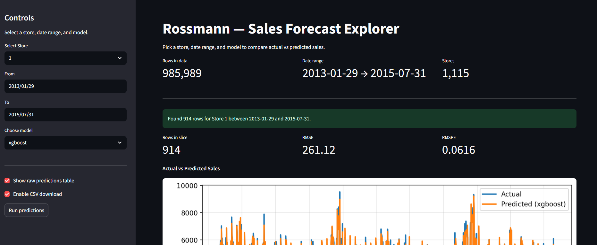
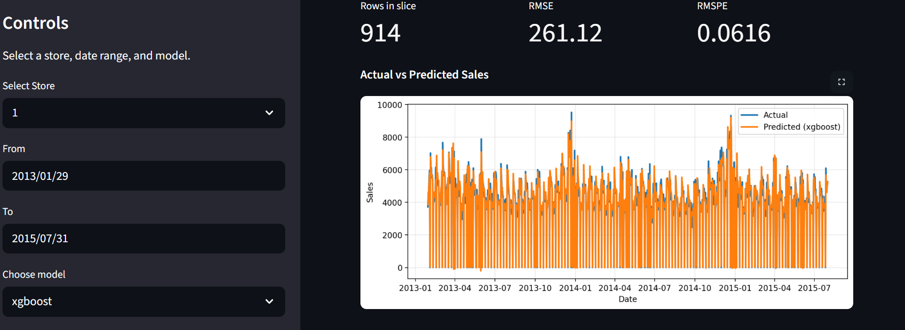
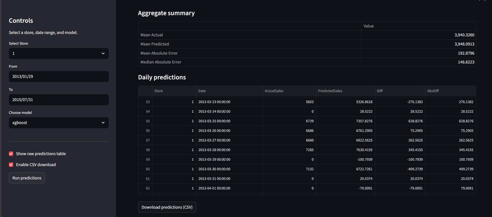

# 📊 Rossmann Sales Forecasting

Forecasting daily sales for Rossmann stores using **Machine Learning**.
This repo contains the **end-to-end pipeline** → data processing, model training, evaluation, and deployment via **Streamlit**.



---

## 🗂️ Repository Structure

```
rossmann_sales_project/
│
├── app.py                  # Streamlit dashboard for visualization
├── src/                    # Training & utility scripts
│   ├── data_preprocessing.py   # Cleans & prepares dataset
│   ├── train_random_forest.py  # Trains Random Forest model
│   ├── train_xgboost.py        # Trains standard XGBoost model
│   ├── train_xgb_bayes.py      # Trains XGBoost with Bayesian optimization
│   ├── train_ensemble.py       # Trains ensemble models (XGB+RF, XGB+LGBM+RF)
│   ├── utils.py                # Helper functions (metrics, save/load models)
│   └── evaluate.py             # Evaluate models & generate results table
│
├── models/                 # Saved models (.pkl)
├── data/                   # Raw & processed datasets
├── notebooks/              # EDA & experiments
├── outputs/                # Logs, validation metrics, plots
├── img/                    # Screenshots for README
├── requirements.txt        # Dependencies
└── README.md               # Project documentation
```

---

## 🧠 Training Scripts in `/src/`

Each training file builds & saves a model in `/models/`.

| Script                   | Purpose                                                                                         | Output                               |
| ------------------------ | ----------------------------------------------------------------------------------------------- | ------------------------------------ |
| `data_preprocessing.py`  | Cleans raw data, handles missing values, encodes categorical features, saves processed dataset. | `data/processed_train.csv`           |
| `train_random_forest.py` | Trains Random Forest model. Good baseline but very large file size (17GB).                      | `models/random_forest.pkl`           |
| `train_xgboost.py`       | Trains standard XGBoost. Best performer with stable validation metrics.                         | `models/xgboost.pkl`                 |
| `train_xgb_bayes.py`     | Runs Bayesian Optimization for XGBoost hyperparams. Validation unstable.                        | `models/xgboost_bayes.pkl`           |
| `train_ensemble.py`      | Trains ensemble models (XGB+RF, XGB+LGBM+RF). Only marginal improvements.                       | `models/ensemble.pkl`                |
| `evaluate.py`            | Loads models, calculates metrics (RMSE, RMSPE), and prints summary.                             | Results table (saved in `/outputs/`) |
| `utils.py`               | Helper functions for metrics, plots, saving/loading pickle files.                               | Utility methods                      |

---

## 📸 Streamlit App Preview

| Dashboard View                  | Forecast Visualization           | Results Table                        |
| ------------------------------- | -------------------------------- | ------------------------------------ |
|  |  |  |

---

## 📊 Model Performance Summary

| Model                      | Train RMSE | Valid RMSE | Valid RMSPE | Notes                                |
| -------------------------- | ---------- | ---------- | ----------- | ------------------------------------ |
| Random Forest              | \~207      | \~560      | \~0.0831    | Overfits, 17+ GB model file.         |
| XGBoost (Standard)         | \~419      | \~460      | \~0.0720    | ✅ Best performer. Small model size. |
| XGBoost (Bayes Opt)        | \~648      | \~649      | inf         | Unstable, bad search space.          |
| Ensemble (XGB + RF)        | \~459      | \~589      | inf         | Worse than plain XGBoost.            |
| Ensemble (XGB + LGBM + RF) | 430–450    | 470–520    | 0.073–0.078 | Stable, but only marginally better.  |

---

## ⚡ Running the Project

### 1️⃣ Clone repo

```bash
git clone https://github.com/Alan21303/rossmann-sales-forecast.git
cd rossmann-sales-forecast
```

### 2️⃣ Install dependencies

```bash
pip install -r requirements.txt
```

### 3️⃣ Train models

Run individual training scripts:

```bash
python src/train_random_forest.py
python src/train_xgboost.py
python src/train_xgb_bayes.py
python src/train_ensemble.py
```

Models will be saved in `/models/`.

### 4️⃣ Evaluate models

```bash
python src/evaluate.py
```

This generates performance metrics in `/outputs/`.

### 5️⃣ Launch Streamlit app

```bash
streamlit run app.py
```

App will be available at 👉 `http://localhost:8501`

---

## ✨ What We Achieved

✔️ Built a **full ML pipeline** (data → model → dashboard).
✔️ Compared multiple models (RF, XGB, Ensembles).
✔️ Identified **XGBoost** as the best model.
✔️ Deployed results via **Streamlit dashboard**.

---
